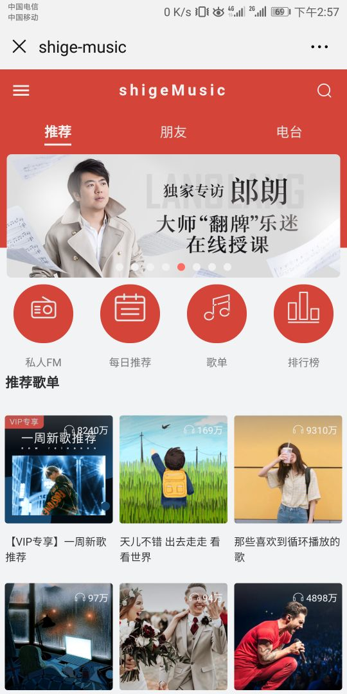
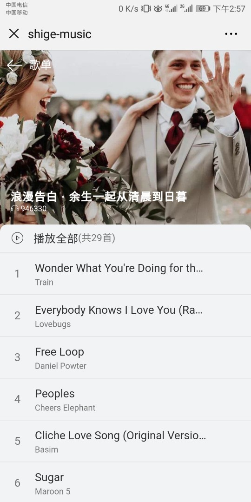
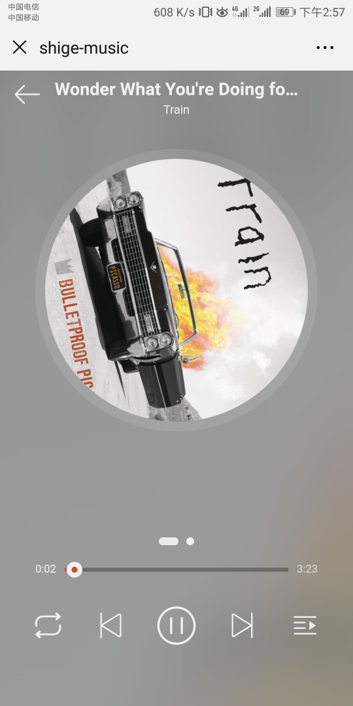
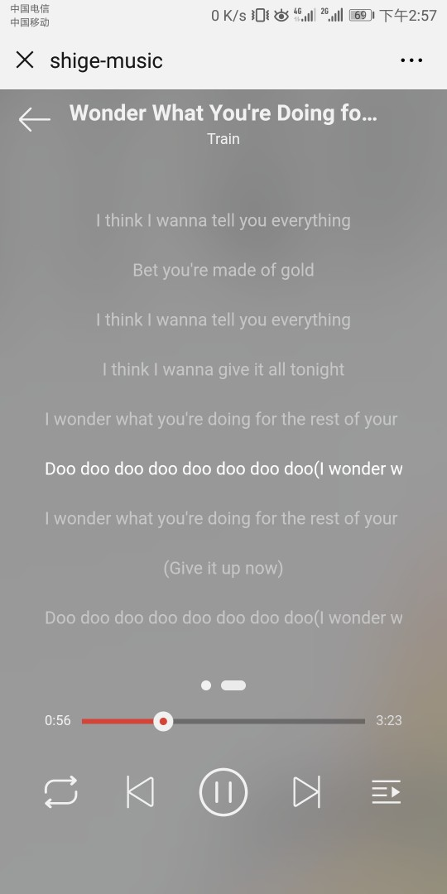
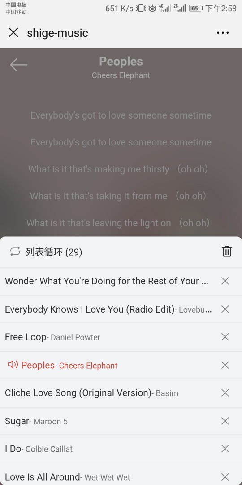
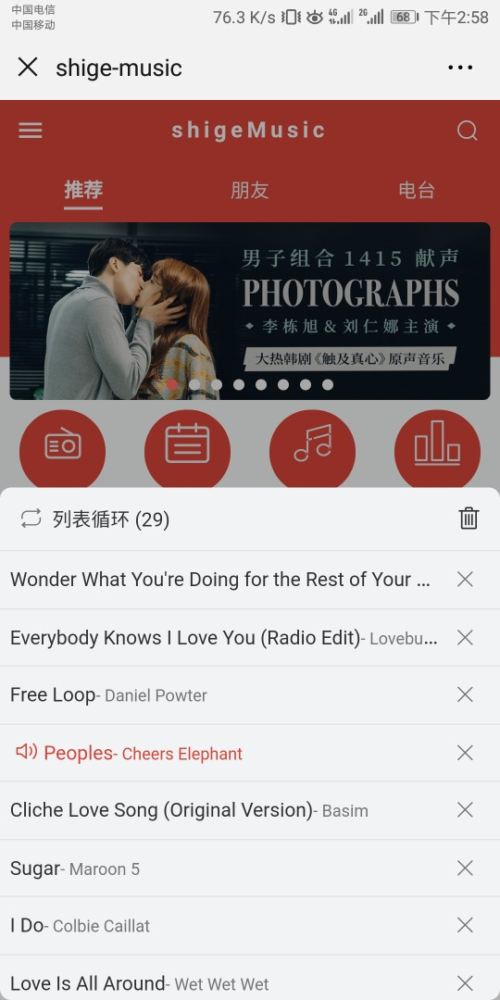
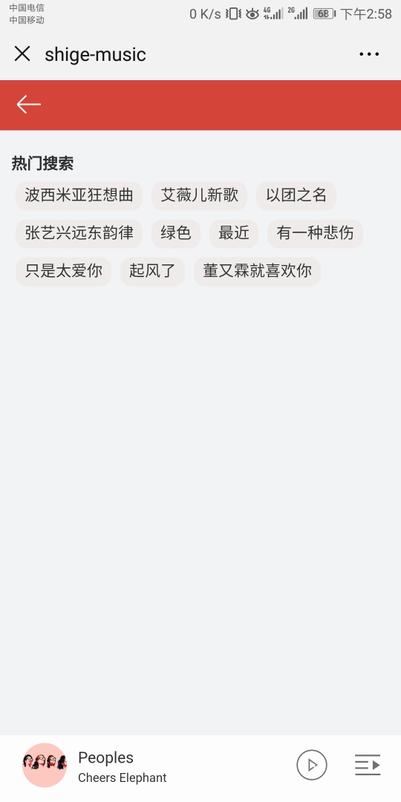
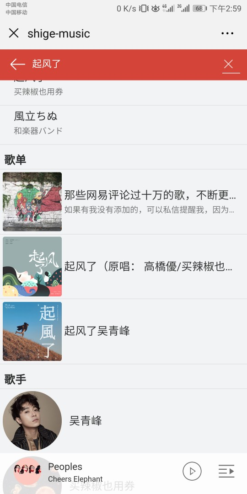
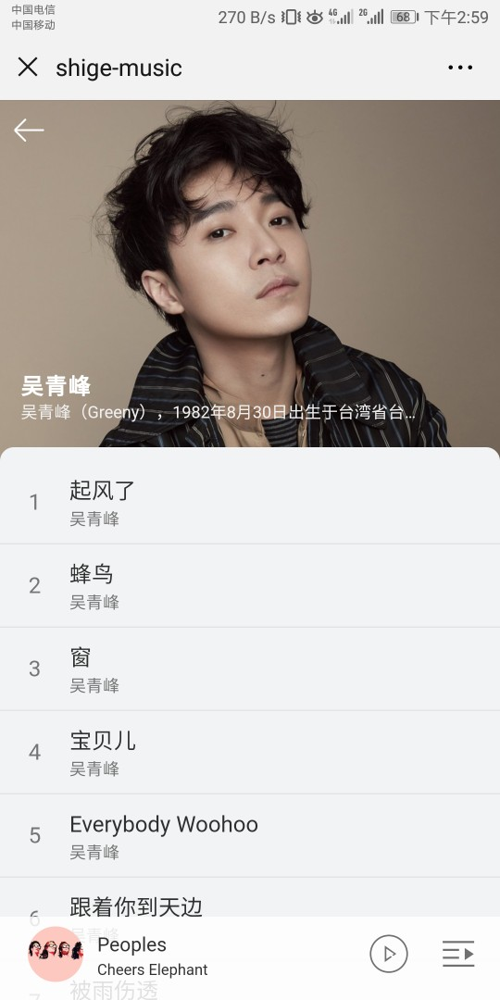

### 基于Vue的仿网易云音乐webapp


#### 前言

------

基于Vue +  Vue-Router + Vuex + axios + Less  ，页面主要参照网易云音乐App , 数据来源于网易云音乐 Node.js API service [**NeteaseCloudMusicApi**](https://github.com/Binaryify/NeteaseCloudMusicApi) ,使用 vh 、vw 等视口单位 Viewport units 来适配移动端 ( 后续考虑用 rem 配合视口单位实现更好的适配 ) 


#### 在线浏览

- 直接访问 [项目演示地址](http://116.62.124.130)
- 手机扫码访问效果更佳 

1核2G1Mbps带宽的渣ECS,加载可能比较慢

####                                              

#### 源码地址

------

[https://github.com/Yaochentao/shigeMusic](https://github.com/Yaochentao/shigeMusic)

欢迎Star


#### 项目部分截图



















#### 技术栈

------

- `Vue`
- `Vue-Router`
- `Vuex`
- `Less`
- `Axios`
- `better-scroll`

#### 项目结构

------

```

│  .browserslistrc
│  .gitignore
│  babel.config.js
│  package-lock.json
│  package.json
│  postcss.config.js
│  README.md
│  vue.config.js     
└─src
    │  App.vue
    │  main.js
    │  registerServiceWorker.js
    │  router.js
    │  store.js
    ├─assets
    │  ├─css
    │  │ reset.css
    │  └─iconfont         
    └─components
        │  loading.vue
        │  progress-bar.vue
        │  scroll.vue
        ├─i-header
        │  i-header.vue
        ├─player
        │  player.vue
        ├─playingList
        │  playingList.vue
        ├─playList
        │  playList.vue
        ├─recommend
        │  recommend.vue
        │  slide.vue
        ├─search
        │  search-result.vue
        │  search.vue
        ├─singer
        │  singer.vue
        ├─song-list
        │  song-list.vue
        └─tab
           tab.vue
```


#### 已实现的功能

------

- 推荐页面

- 歌单页面

- 搜索功能 

- 歌手页面

- 播放器（播放/暂停 ，切换歌曲 ，调整播放进度，歌词，播放模式切换 ，播放列表）

  

#### 有待开发的功能

------

- 登录功能（很多api都需要登录才能访问）
- 私人FM
- 每日推荐
- 排行榜
- 电台
- 朋友动态

#### 存在的bug

------

- 歌曲刚加载完时点击暂停会出现歌曲还是继续播放的情况
- 播放需要vip的歌曲时没加判断，会产生无法播放且没提示的bug
- 其他bug暂时还没发现，欢迎发现

#### 开发中遇到的问题

------

- vue中调用防抖/节流函数时`methods`中的函数用省略写法会出现防抖函数内部return的函数不执行的情况

  ```
  methods:{
  	test:Throttle(function(){
  	...
  	 },1000),
  	 
  	 test() {
           Throttle(function(){
          	...
           },1000),
  	 }  //这种写法会出现防抖/节流函数内部return的函数不执行的情况
  	 
  }
  ```

  具体为什么会出现这种情况至今懵逼中。。欢迎大神解答

- vuex对获取state或者getter之后最好深拷贝一份再进行操作（血的教训）

```
changeMode() {
    console.log('changemode')
    const mode = (this.$store.state.mode + 1) % 3;
    this.$store.commit('SET_PALY_MODE',mode);
    let list = null;
    let _list = this.sequenceList.slice(0);   //此处对this.sequenceList进行深拷贝
    //   如直接将this.sequenceList传入shuffle函数会无意中修改state中的sequenceList
    if (mode === 2) {
        console.log('mode2')
        list = this.shuffle(_list);  //洗牌函数
    } else {
        console.log('mode01')
        list = _list
    }
    this.$store.commit('SET_PLAYLIST',list);
},
```

一开始没进行深拷贝就开始操作了，发现state中的sequenceList被修改了，控制台也没报错。一开始没往深拷贝那方面想（因为记得好像不通过mutation修改state中的值的话会报一个`Do not mutate vuex store state outside mutation handlers.`的error）。后面把数据深拷贝了一份再进行操作，发现bug消失了。。好吧，深浅拷贝的锅。

- 组件获取dom和一般html元素获取dom

  ```
  <scroll ref='scroll-component'/>
  //若要访问引入的组件的对应的dom则需要访问其el属性this.$refs.scroll-component.$el
  
  
  <div ref='scroll-html'></div>
  //一般html元素只需this.$refs.scroll-html即可
  ```

  

- 当用了`keep-active`组件时，会缓存不活动的组件实例，而不是销毁它们。故子组件不用时不会销毁，`created`等生命周期函数不会调用，`actived()`函数会被调用


感谢阅读~~~